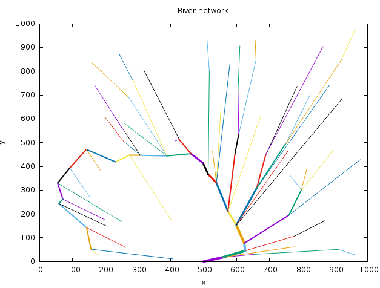
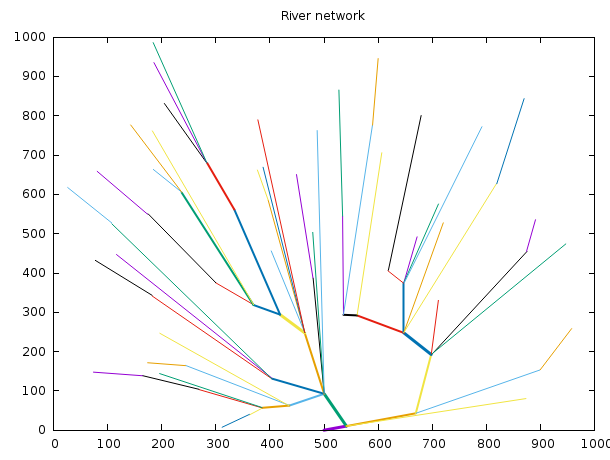

# River networks
Sandbox for playing around with procedural generation of river networks.

## Installation

Clone the repo and then run:

``git clone https://github.com/mzdravkov/river_networks``

``cd river_networks``

``bundle``

``ruby river_networks.rb``

The algorithm uses a default value of 100 helper points. If you want more dense river network, pass bigger number as an argument. For example:

``ruby river_networks.rb 180``

## Results
Here are few samples created by the algorithm.

## Algorithm overview
The basic idea is that you put some helper points at random locations in rectangular area. One of these points is a special point, where the mouth of the river will be (it's at (Xmax/2, 0)). Then you iterate while there are helper points. On each iteration you:

* Add new point (this will be part of the river network) at the  of the current point's nearest two helper points. (the current point at the beginnig is the mouth point, after that it's the last placed point)

* Add new limit. Limit is a line starting from the mouth, running through the current point and going to infinity. Limits define in what part of the total area we searching for nearest two points. When there is less than 2 limits we search in the total area (because with one limit you split the area to two parts and don't know which part to take).

* Remove the the two helper points.

* If there is no more points in the area remove the last limit and set the current point to be the parent of the current. (if there is only one point left, you delete it)

Here is an ugly visualization (probably, when combined with the above unclear explanation it may provide some insight):

## TODO:
Make spline interpolations for the rivers, so that they have more natural and interesting look.
