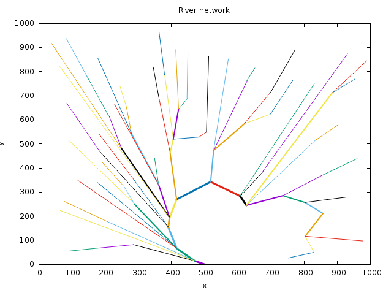
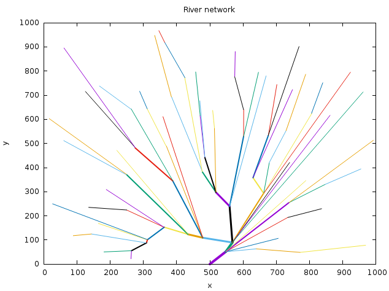

# River networks
Sandbox for playing around with procedural generation of river networks.

## Installation

Clone the repo and then run:
``git clone https://github.com/mzdravkov/river_networks``
``cd river_networks``
``bundle``
``ruby river_networks.rb``

The algorithm uses a default value of 100 helper points. If you want more dense river network, pass bigger number as an argument. For example:
``ruby river_networks.rb 180``

## Results
Here are few samples created by the algorithm.

## TODO:
Make spline interpolations for the rivers, so that they have more natural and interesting look.
